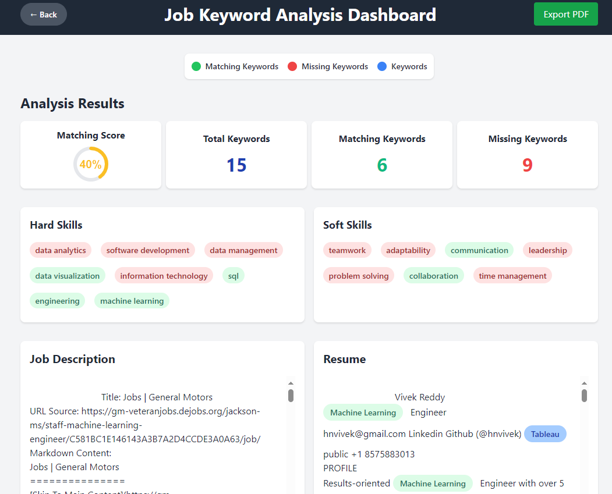
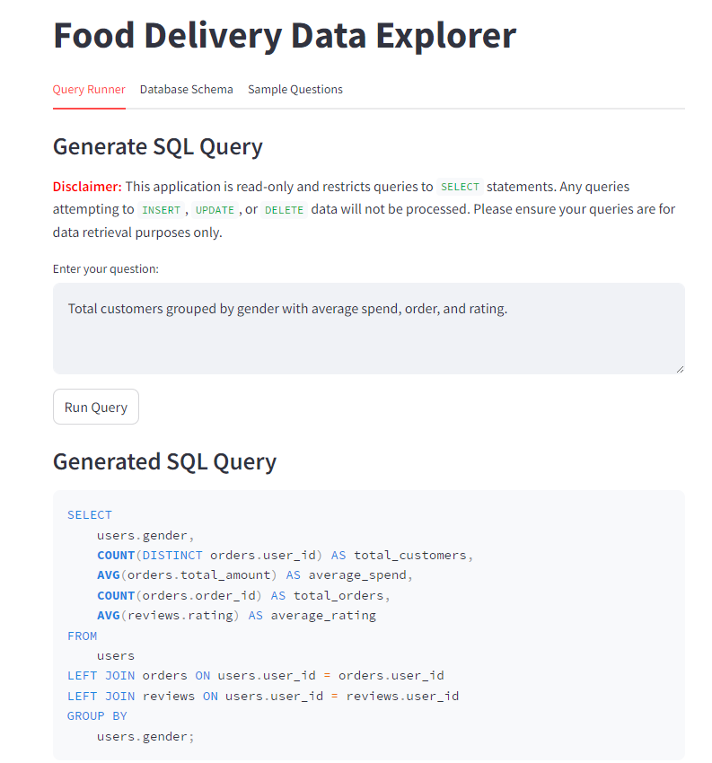

# Hi there! 👋 I'm Vivek, a Senior Engineer with a passion for Data Analytics & Machine Learning

Welcome to my profile! I specialize in developing innovative solutions that harness the power of data to solve business challenges. With a Master's degree in Data Analytics and extensive experience in Machine Learning, I bring a unique blend of technical and analytical expertise to every project.

## What I Do

As a Senior Engineer, I create advanced algorithms and models that extract meaningful insights from complex datasets. I focus on building scalable machine learning systems that can handle large volumes of data efficiently. One of my core strengths is designing end-to-end data pipelines that ensure seamless data processing and integration.

I also excel in developing intuitive dashboards and visualizations that make data accessible and actionable. These tools help businesses leverage their data to make informed, strategic decisions.

## Recent Applications

| Project Name | Description | Image |
|--------------|-------------|-------|
| [Job Resume Match](https://job-resume-match-production.up.railway.app/) | Match your resume with any job description and download the report. Also, generate a keyword-optimized cover letter for a given job description. |  |
| [LLM Text to SQL Query Dashboard](https://llm-text-2-sql-query-dashboard-production.up.railway.app/) | A cutting-edge data analysis tool that leverages the power of Large Language Models (LLMs) to transform natural language queries into SQL, providing effortless insights into food delivery data. |  |

 
 

---

## Languages and Tools

I work with a variety of technologies and tools:                

---

## Fun Facts

On a lighter note, when I'm not engrossed in data-driven pursuits, you'll often find me on the cricket field, playing the sport I adore. Music is my constant companion, fueling my creativity and keeping me motivated throughout the journey.

I look forward to connecting with like-minded individuals and exploring the endless possibilities that data and technology have to offer!

---
